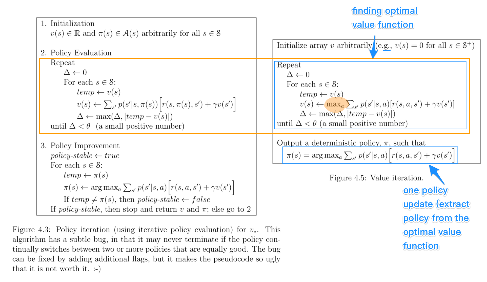

## 深度强化学习面试题目总结
1. 什么是强化学习？
> 强化学习（Reinforcement Learning, RL），又称增强学习，是机器学习的范式和方法论之一，用于描述和解决智能体（agent）在与环境的交互过程中通过学习策略以达成回报最大化或实现特定目标的问题

>
>
2. 强化学习和监督学习、无监督学习的区别是什么？
> 监督学习一般有标签信息，而且是单步决策问题，比如分类问题。监督学习的样本一般是独立
>同分布的。无监督学习没有任何标签信息，一般对应的是聚类问题。强化学习介于监督和无监督学
>习之间，每一步决策之后会有一个标量的反馈信号，即回报。通过最大化回报以获得一个最优策略。
>因此强化学习一般是多步决策，并且样本之间有强的相关性。
>
>
3. 强化学习适合解决什么样子的问题？
> 强化学习适合于解决模型未知，且当前决策会影响环境状态的（序列）决策问题。Bandit问题可以
>看成是一种特殊的强化学习问题，序列长度为1，单步决策后就完事了，所以动作不影响状态。当然也有影响
>的bandit问题，叫做contextual bandit问题。
>
>
4. 强化学习的损失函数（loss function）是什么？和深度学习的损失函数有何关系？
> 累积回报。依赖于不同的问题设定，累积回报具有不同的形式。比如对于有限长度的MDP问题直接用
>回报和作为优化目标。对于无限长的问题，为了保证求和是有意义的，需要使用折扣累积回报或者平均
>回报。深度学习的损失函数一般是多个独立同分布样本预测值和标签值的误差，需要最小化。强化学习
>的损失函数是轨迹上的累积和，需要最大化。
>
>
5. POMDP是什么？马尔科夫过程是什么？马尔科夫决策过程是什么？里面的“马尔科夫”体现了什么性质？
> POMDP是部分可观测马尔科夫决策问题。
>马尔科夫过程表示一个状态序列，每一个状态是一个随机变量，变量之间满足马尔科夫性，表示为
>一个元组<S, P>，S是状态，P表示转移概率。
>MDP表示为一个五元组<S, A, P, R, $\gamma$>，S是状态集合，A是动作集合，P表示转移概率，即模型，
>R是回报函数，$\gamma$表示折扣因子。
>马尔科夫体现了无后效性，也就是说未来的决策之和当前的状态有关，和历史状态无关。
>

6. 贝尔曼方程的具体数学表达式是什么？
> 对于状态值函数的贝尔曼方程：
>
>
>
>对于动作值函数的贝尔曼方程：
>
>

7. 最优值函数和最优策略为什么等价？
> 最优值函数唯一的确定了某个状态或这状态-动作对相对比他状态和状态-动作对的利好，我们可以
>依赖这个值唯一的确定当前的动作，他们是对应的，所以等价。

8. 值迭代和策略迭代的区别?
> 策略迭代。它有两个循环，一个是在策略估计的时候，为了求当前策略的值函数需要迭代很多次。
>另外一个是外面的大循环，就是策略评估，策略提升这个循环。值迭代算法则是一步到位，直接估计
>最优值函数，因此没有策略提升环节。
>
>Key points:

### Policy iteration includes: policy evaluation + policy improvement, and the two are repeated iteratively until policy converges.

### Value iteration includes: finding optimal value function + one policy extraction. There is no repeat of the two because once the value function is optimal, then the policy out of it should also be optimal (i.e. converged).

### Finding optimal value function can also be seen as a combination of policy improvement (due to max) and truncated policy evaluation (the reassignment of v_(s) after just one sweep of all states regardless of convergence).

### The algorithms for policy evaluation and finding optimal value function are highly similar except for a max operation (as highlighted)

### Similarly, the key step to policy improvement and policy extraction are identical except the former involves a stability check.

### In my experience, policy iteration is faster than value iteration, as a policy converges more quickly than a value function. I remember this is also described in the book.

>参考[值迭代算法](https://zhuanlan.zhihu.com/p/55217561)
>
>
9. 如果不满足马尔科夫性怎么办？当前时刻的状态和它之前很多很多个状态都有关之间关系？
> 如果不满足马尔科夫性，强行只用当前的状态来决策，势必导致决策的片面性，得到不好的策略。
>为了解决这个问题，可以利用RNN对历史信息建模，获得包含历史信息的状态表征。表征过程可以
>使用注意力机制等手段。最后在表征状态空间求解MDP问题。
If it is not satisfied for Markovian condition, we can only use the current state to make decision, which leads to the decision to be partial and a bad decision result. To sovle this problem, we can use RNN to model the historical information and obtain the state representation includes the historical information. In the representation process, we can use attention mechanism such as Encoder-Decoder. Finally, we can solve the MDP process at the representation space.

10. 求解马尔科夫决策过程都有哪些方法？有模型用什么方法？动态规划是怎么回事？
> 方法有：动态规划，时间差分，蒙特卡洛。 (Methods include: Dynamic programming, temporal-difference learning and Monto-carlo)
>有模型可以使用动态规划方法。
>动态规划是指：将一个问题拆分成几个子问题，分别求解这些子问题，然后获得原问题的解。
>贝尔曼方程中为了求解一个状态的值函数，利用了其他状态的值函数，就是这种思想（个人觉得）。
>
>
11. 简述动态规划(DP)算法？
> 不知道说的是一般的DP算法，还是为了解决MDP问题的DP算法。这里假设指的是后者。总的来说DP方法
>就是利用最优贝尔曼方程(Bellman Optimality Equation)来更新值函数以求解策略的方法。最优贝尔曼方程如下：
>
>
>参考[DP算法概述](https://zhuanlan.zhihu.com/p/54763496/edit)
>
>
12. 简述蒙特卡罗估计值函数(MC)算法。
> 蒙特卡洛就死采样仿真，蒙特卡洛估计值函数就是根据采集的数据，利用值函数的定义来更新
>值函数。这里假设是基于表格的问题，步骤如下：
>
>初始化，这里为每一个状态初始化了一个 Return(s) 的列表。可以想象列表中每一个元素就是一次累积回报。
>
>根据策略pi生成轨迹tau
>
>利用轨迹，统计每个状态对应的后续累积回报，并将这个值加入对应状态的Return(s)列表
>
>重复若干次，每次都会往对应出现的状态回报列表中加入新的值。最后根据定义，每个状态回报列表中数字的均值
>就是他的值估计
>
>参考[MC值估计](https://zhuanlan.zhihu.com/p/55487868)

13. 简述时间差分(TD)算法。
> TD,MC和DP算法都使用广义策略迭代来求解策略，区别仅仅在于值函数估计的方法不同。DP使用的是贝尔曼
>方程，MC使用的是采样法，而TD方法的核心是使用自举（bootstrapping），即值函数的更新为：
>V(s_t) <-- r_t + \gamma V(s_next)，使用了下一个状态的值函数来估计当前状态的值。

14. 简述动态规划、蒙特卡洛和时间差分的对比（共同点和不同点）
> 此时必须祭出一张图：
>
>
>
>简单来说，共同点：都是用来估计值函数的一种手段。
>
>不同点：
>
>MC通过采样求均值的方法求解；DP由于已知模型，因此直接可以计算期望，不用采样，但是DP仍然
>使用了自举；TD结合了采样和自举

15. MC和TD分别是无偏估计吗？
> MC是无偏的，TD是有偏的

16. MC、TD谁的方差大，为什么？
> MC的方差大，以为TD使用了自举，实现一种类似于平滑的效果，所以估计的值函数方差小。
>
17. 简述on-policy和off-policy的区别
> on-policy:行为策略和要优化的策略是一个策略，更新了策略后，就用该策略的最新版本采样数据，
>。off-policy：使用任意的一个行为策略来收集收据，
>利用收集的数据更新目标策略。
>
>
18. 简述Q-Learning，写出其Q(s,a)更新公式。它是on-policy还是off-policy，为什么？
> Q学习是通过计算最优动作值函数来求策略的一种算法，更新公式为：
>
>Q(s_t, a_t) <--- Q(s_t, a_t) + \alpha [R_{t+1} + \gamma \max_a Q(s_{t+1}, a) - Q(s_t, a_t)]
>
>是离策略的，由于是值更新使用了下一个时刻的argmax_a Q，所以我们只关心哪个动作使得 Q(s_{t+1}, a) 取得最大值，
>而实际到底采取了哪个动作（行为策略），并不关心。
>这表明优化策略并没有用到行为策略的数据，所以说它是离策略（off-policy）的。
>
>
19. 写出用第n步的值函数更新当前值函数的公式（1-step，2-step，n-step的意思）。当n的取值变大时，期望和方差分别变大、变小？
> n-step的更新目标：
>
> 
>
>利用更细目标更新当前值函数，趋近于目标：
>
>
>
>当n越大时，越接近于MC方法，因此方差越大，期望越接近于真实值，偏差越小。

20. TD（λ）方法：当λ=0时实际上与哪种方法等价，λ=1呢？
> 当lambda = 0等价于TD(0);lambda = 1时等价于折扣形式的MC方法。参考[文章](https://zhuanlan.zhihu.com/p/72587762)。

21. 写出蒙特卡洛、TD和TD（λ）这三种方法更新值函数的公式？
> MC更新公式参考问题14附图（左图公式），如果是单步的TD方法，更新公式参考问题14附图（中），
>n步的更新参考问题19。TD(lambda)用lambda-return更新值函数，lambda-return是n-step
>return的加权和，n-step回报的系数为\lmabda^{n-1}，所以lambda-return等于：
>
>
>
>所以TD(lambda)的更新公式只需要把问题19的更新公式中的G_{t:t+n}换成上图的G_t^lambda就行。
>当然这种更新叫做前向视角，是离线的，因为要计算G_t^n，为了在线更新，需要用到资格迹。定义
>资格迹为：
>
>
>
>利用资格迹后，值函数可以在线更新为：
>
>
>
>更多的关于TD(lambda)细节参考[文章](https://amreis.github.io/ml/reinf-learn/2017/11/02/reinforcement-learning-eligibility-traces.html)

22. value-based和policy-based的区别是什么？
> value-based通过求解最优值函数间接的求解最优策略；policy-based的方法直接将策略参数化，
>通过策略搜索，策略梯度或者进化方法来更新策略的参数以最大化回报。基于值函数的方法不易扩展到
>连续动作空间，并且当同时采用非线性近似、自举和离策略时会有收敛性问题。策略梯度具有良好的
>收敛性证明。
23. DQN的两个关键trick分别是什么？
> 使用目标网络(target network)来缓解训练不稳定的问题；经验回放

24. 阐述目标网络和experience replay的作用？
> 在DQN中某个动作值函数的更新依赖于其他动作值函数。如果我们一直更新值网络的参数，会导致
>更新目标不断变化，也就是我们在追逐一个不断变化的目标，这样势必会不太稳定。引入目标网络就是把
>更新目标中不断变化的值先稳定一段时间，更新参数，然后再更新目标网络。这样在一定的阶段内
>目标是固定的，训练也更稳定。
>
>经验回放应该是为了消除样本之间的相关性。
25. 手工推导策略梯度过程？
> 

参考[文章](https://spinningup.openai.com/en/latest/spinningup/rl_intro3.html)

26. 描述随机策略和确定性策略的特点？
> 随机策略表示为某个状态下动作取值的分布，确定性策略在每个状态只有一个确定的动作可以选。
>从熵的角度来说，确定性策略的熵为0，没有任何随机性。随机策略有利于我们进行适度的探索，确定
>性策略的探索问题更为严峻。

27. 不打破数据相关性，神经网络的训练效果为什么就不好？
> 在神经网络中通常使用随机梯度下降法。随机的意思是我们随机选择一些样本来增量式的估计梯度，比如常用的
> 采用batch训练。如果样本是相关的，那就意味着前后两个batch的很可能也是相关的，那么估计的梯度也会呈现
> 出某种相关性。如果不幸的情况下，后面的梯度估计可能会抵消掉前面的梯度量。从而使得训练难以收敛。

28. 画出DQN玩Flappy Bird的流程图。在这个游戏中，状态是什么，状态是怎么转移的？奖赏函数如何设计，有没有奖赏延迟问题？

29. DQN都有哪些变种？引入状态奖励的是哪种？
> Double DQN, 优先经验回放， Dueling-DQN

30. 简述double DQN原理？
> DQN由于总是选择当前值函数最大的动作值函数来更新当前的动作值函数，因此存在着过估计问题（估计的值函数大于真实的值函数）。
> 为了解耦这两个过程，double DQN 使用了两个值网络，一个网络用来执行动作选择，然后用另一个值函数对一个的动作值更新当前
> 网络。比如要更新Q1， 在下一个状态使得Q1取得最大值的动作为a*，那么Q1的更新为 r + gamma (Q2(s_, a*).二者交替训练。

31. 策略梯度方法中基线baseline如何确定？
> 基线只要不是动作a的函数就可以，常用的选择可以是状态值函数v(s)

32. 画出DDPG框架结构图？

33. Actor-Critic两者的区别是什么？
> Actor是策略模块，输出动作；critic是判别器，用来计算值函数。

34. actor-critic框架中的critic起了什么作用？
> critic表示了对于当前决策好坏的衡量。结合策略模块，当critic判别某个动作的选择时有益的，策略就更新参数以增大该动作出现的概率，反之降低
> 动作出现的概率。

35. DDPG是on-policy还是off-policy，为什么？
> off-policy。因为在DDPG为了保证一定的探索，对于输出动作加了一定的噪音，也就是说行为策略不再是优化的策略。

36. 是否了解过D4PG算法？简述其过程

37. 简述A3C算法？A3C是on-policy还是off-policy，为什么？
38. A3C算法是如何异步更新的？是否能够阐述GA3C和A3C的区别？
39. 简述A3C的优势函数？
40. 什么是重要性采样？
41. 为什么TRPO能保证新策略的回报函数单调不减？
42. TRPO是如何通过优化方法使每个局部点找到让损失函数非增的最优步长来解决学习率的问题；
43. 如何理解利用平均KL散度代替最大KL散度？
44. 简述PPO算法？与TRPO算法有何关系？
45. 简述DPPO和PPO的关系？
46. 强化学习如何用在推荐系统中？
47. 推荐场景中奖赏函数如何设计？
48. 场景中状态是什么，当前状态怎么转移到下一状态？
49. 自动驾驶和机器人的场景如何建模成强化学习问题？MDP各元素对应真实场景中的哪些变量？
50. 强化学习需要大量数据，如何生成或采集到这些数据？
51. 是否用某种DRL算法玩过Torcs游戏？具体怎么解决？
52. 是否了解过奖励函数的设置(reward shaping)？

### 贡献致谢列表
@[huiwenzhang](https://github.com/huiwenzhang)

#### 参考及引用链接：

[1]https://zhuanlan.zhihu.com/p/33133828 
[2]https://aemah.github.io/2018/11/07/RL_interview/
